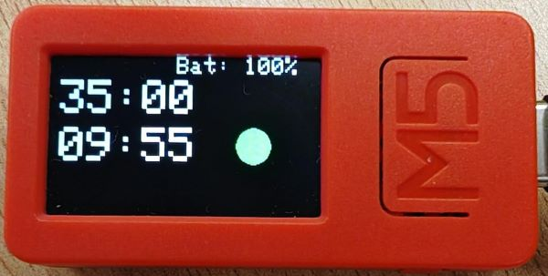

# Pomoduino 🍅⏱️
## Description

Pomoduino is an **Arduino-based Pomodoro Timer** designed to enhance productivity by alternating between work and break intervals. The timer operates on two platforms:

- **Arduino UNO:** With TM1637 displays, LEDs, and rotary encoder.
- **M5StickC Plus:** With integrated display, button, and battery monitoring.

M5StickCPlus                                         |  Arduino UNO 
:--------------------------------------------------:|:------------------------------------------------:
  |  


## Features

- **Dual Timer:** 35-minute work timer and 10-minute break timer.
- **User-Friendly Interface:** Rotary encoder or integrated M5 button to manage the timer.
- **Visual Indicators:** LEDs or display elements to indicate the current mode.
- **Battery Monitor (M5StickC Plus):** Displays battery percentage and status.
- **Seamless Transition:** Automatically switches between timers or allows manual overrides.

## Required Components

### Arduino UNO Version

- **Arduino UNO**
- **2x TM1637 Displays**
- **Rotary Encoder with Button**
- **2x LEDs (Red and Green)**
- **330Ω Resistors (for LEDs)**
- **10kΩ Resistors (optional for encoder)**
- **Breadboard and Wires**

### M5StickC Plus Version

- **M5StickC Plus**
- **Built-in button**
- **Built-in display**

## Circuit Diagram

For the Arduino UNO setup, refer to the circuit diagram below:

[Pending to add]


## UML Class Diagram

The system's architecture is designed with modularity and scalability in mind. Below is the UML class diagram for the project:


## Installation

### Prerequisites

- **PlatformIO:** [PlatformIO](https://platformio.org/) is recommended for development.
- **Required Libraries:**
  - TM1637 (for Arduino UNO version)
  - M5StickCPlus (for M5StickC Plus version)

### Clone the Repository

```bash
git clone https://github.com/arfipod/pomoduino.git
cd pomoduino
```

### Compile and Upload the Code

1. Open the project in your editor (e.g., Visual Studio Code with PlatformIO).
2. Connect your device (Arduino UNO or M5StickC Plus).
3. Select the appropriate build environment (`uno` or `m5stickc`).
4. Compile and upload the code:
   ```bash
   pio run --target upload
   ```

## Usage

1. **Starting the Timer:**
   - **Idle Mode:** Displays `35:00` for work and `10:00` for break.
   - **Start:** Press the button to begin the work timer.

2. **Switching Timers:**
   - Press the button during an active timer to switch between work and break.

3. **Visual Indicators:**
   - **Red LED/Display:** Active work timer.
   - **Green LED/Display:** Active break timer.

4. **Battery Monitoring (M5StickC Plus):**
   - Displays battery status on the screen.

## Project Structure

```
/pomoduino
│
├── src
│   ├── main.cpp
│   ├── Controller.cpp
│   ├── DisplayViewer.cpp
│   ├── EncoderButton.cpp
│   ├── LEDIndicator.cpp
│   ├── TimerModule.cpp
│   ├── M5Button.cpp
│   ├── M5Buzzer.cpp
│   ├── ScreenIndicator.cpp
│   ├── TextViewer.cpp
│   ├── EncoderModule.cpp
│   └── LEDModule.cpp
│
├── include
│   ├── Controller.h
│   ├── DisplayViewer.h
│   ├── EncoderButton.h
│   ├── IButton.h
│   ├── ILight.h
│   ├── ITimer.h
│   ├── ITImeViewer.h
│   ├── IBuzzer.h
│   ├── LEDIndicator.h
│   ├── TimerModule.h
│   ├── M5Button.h
│   ├── M5Buzzer.h
│   ├── ScreenIndicator.h
│   ├── TextViewer.h
│   ├── EncoderModule.h
│   └── LEDModule.h
│
├── lib
│   └── TM1637Display
│       ├── TM1637Display.h
│       └── TM1637Display.cpp
│
├── images
│   ├── pomodoro_timer.jpg         # Visualization of the final device
│   ├── circuit_diagram.png        # Circuit diagram (rendered from Circuitikz)
│   └── uml_diagram.png            # UML diagram of the project
│
├── test
│   └── README                     # Placeholder for PlatformIO tests
│
├── platformio.ini                 # Project configuration file
├── README.md                      # Documentation of the project
└── LICENSE                        # MIT License for the project

```

## Contributing

1. Fork the repository.
2. Create a feature branch:
   ```bash
   git checkout -b feature/new-feature
   ```
3. Commit your changes:
   ```bash
   git commit -m "Add new feature"
   ```
4. Push to the branch:
   ```bash
   git push origin feature/new-feature
   ```
5. Open a pull request.

## License

This project is licensed under the MIT License. See the [LICENSE](LICENSE) file for details.

## Contact

For questions or suggestions:

- **Name:** Ángel R. Rubio Fernández
- **Email:** arfipod@gmail.com
- **GitHub:** [arfipod](https://github.com/arfipod)
